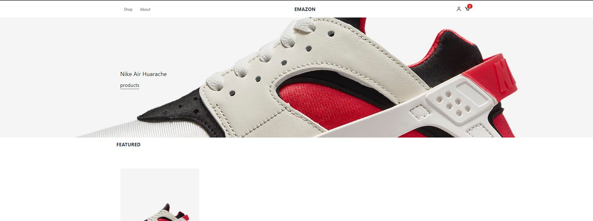

## EMAZON

An e-commerce website that allows user's to create (if authorized) , view and buy (with an actual payment gateway) any product listed on the site, built with React, Redux, Stripe, JavaScript, and TailwindCSS.

## Project Status

The project is live @ https://dev.d18l4ngipcru6x.amplifyapp.com/
The project is currently in the MVP (Minimum Viable Product) State, a guide on how to utilize the site as a demo coming.
Future updates:

<ul>
  <li>Better looking Admin Panel</li>
  <li>User can view their orders, Admin can view all orders</li>
  <li>User reviews on products</li>
  <li>User wishlist on products</li>
  <li><del>Persist cart state </del>  Does not persist in database</li>
  <li>Save more user data</li>
  <li>Product Company creation, allow certified "companies"  to upload their products.</li>
</ul>
## Project Screen Shot(s)

Screen shots coming soon.

## Installation and Setup Instructions

Clone down this repository. You will need `node` and `npm` installed globally on your machine.

Installation:

`npm install`

To Start Server:

`npm start`

To Visit App:

`localhost:3000/`

## Reflection

This was a side project developed during my spare time. The goal of the project was to develop an e-commerce platform using technologies i've never used before and get accustom to developing for future features.

I wanted to build an e-commerce platform using new technologies such as React Redux (for handling data), Tailwind CSS (class based CSS framework), Stripe (for handling payments) and AWS Amplify (server back end). I started this process by using the `create-react-app` boilerplate, then adding `react-router-5.0`, `tailwindcss`, `aws-amplify`, `stripe` and `redux`.

One of the biggest challenges I faced during development was making sure that my react components where broken down properly and setting up react redux the same way big companies use it. I eventually decided to follow [AirBnB](https://airbnb.io/javascript/react/)'s style guide and combine [redux shopping cart example](https://github.com/reduxjs/redux/tree/5855f71a43ce4a701b7e6ed1dbc083db83b766d7/examples/shopping-cart) and [Bruce Pouncey e-commerce template](https://github.com/BPouncey/ReactJS-ecommerce-template) to form the redux state management being used in the application.

Some unexpected obstacles were Tailwind CSS not styling the way I wanted it to style and Amazon Amplify requiring a lot of research to fully understand and integrate with Stripe.

I decided to use React, Redux, Stripe, Amazon Amplify, TailWind CSS because these technologies are popular and important to learn. React is by far the most popular javascript framework and react redux is the best for state management across multiple applications. Amazon amplify provided an out of the box storage and user management system and Tailwind CSS was a fresh intro to purely using CSS classes to style ANYTHING. All in all, I learned a lot from this project.
